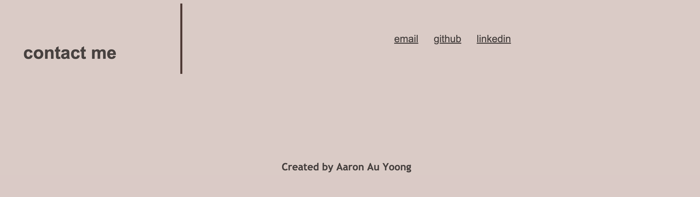

# 02 Advanced CSS: Portfolio
Project Owner - Aaron Au Yoong
 
View portfolio live link here: https://aaronauyoong.github.io/aaronauyoongportfolio/ 

## Introduction
This is a web application created for the purpose of becoming my personal portfolio page, which will be updated as the course progresses. This portfolio page will display my talent and skills as a web developer to potential employers.

## Technologies
Technologies used in this portfolio creation include:
- My own HTML page, created from scratch. 
- My own CSS style sheet, created from scratch. 
- Other assets such as my own images to show employers how I look like, alongside placeholder images from Shutterstock (will  be replaced with applications  I create in the future). 

## Project Requirements
Below are the requirements for this portfolio page:
- Employers can view my deployed portfolio.
- Employers can view my deployed work samples. 
- Employers can assess whether I am a good candidate for an open position in their company. 

## Wireframe
Below is a wireframe created for the first version of my portfolio. 
 

## Screenshots
Screenshots of portfolio version 1 are below. 
 

 

 

 

